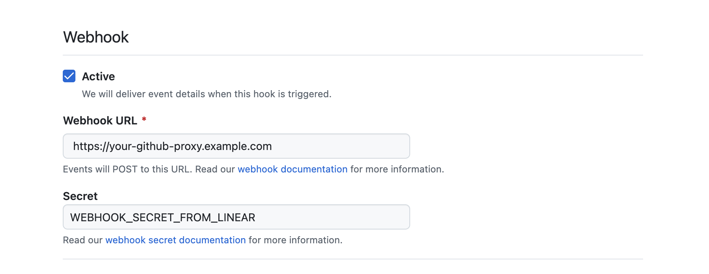
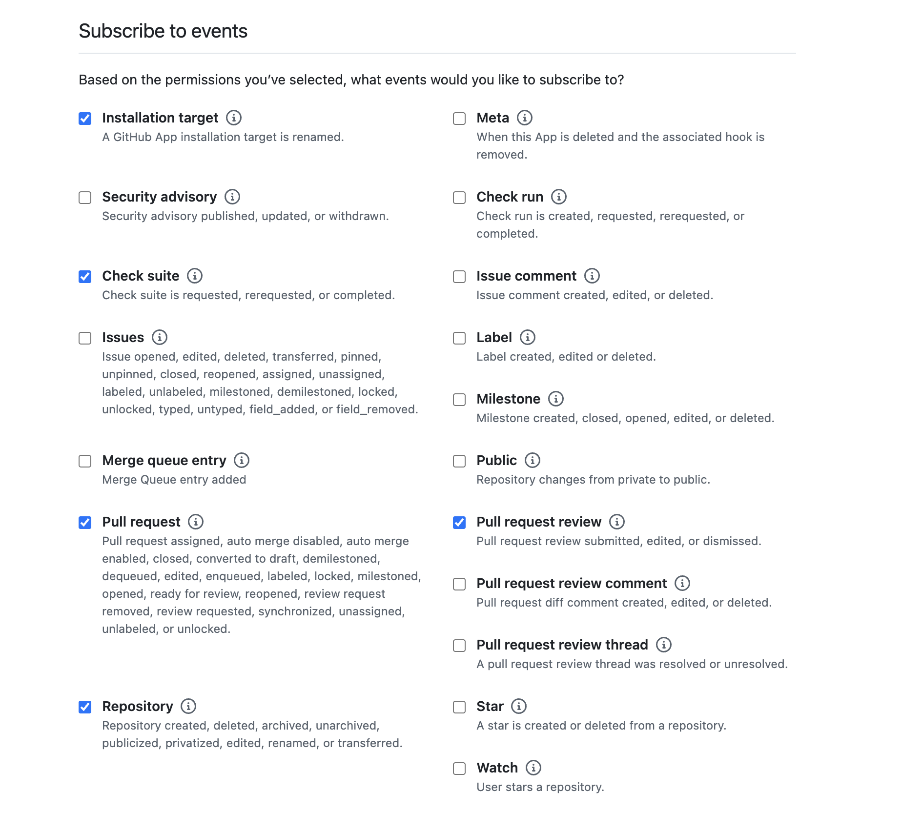

# GitHub Webhook Sanitization Proxy

A proxy server that sanitizes GitHub webhook payloads before forwarding them to Linear's GitHub Enterprise Server integration. This removes sensitive information from PR titles, bodies, and branch names while preserving Linear issue IDs for linking.

## Overview

This proxy is designed for Linear's **GitHub Enterprise Server** integration. It sits between your GitHub Enterprise Server and Linear, sanitizing webhook payloads before they reach Linear. It works for both GHES and GitHub.com. Difference to regular GitHub.com integration is that you'll install a custom version of Linear's GitHub App which modified webhook address.

```
GitHub.com → Proxy (sanitize) → Linear
```

The proxy:
1. **Filters events** - Only forwards whitelisted webhook events
2. **Validates signatures** - Verifies GitHub's HMAC-SHA256 signature
3. **Sanitizes payloads** - Removes sensitive text, preserves Linear issue IDs
4. **Re-signs requests** - Signs the modified payload for Linear

## Setup

### 1. Start Linear's GitHub Enterprise Server Integration

In Linear, go to **Settings → Integrations → GitHub Enterprise Server** and install. Use `https://github.com` as the instance location. Linear will generate a **Webhook Secret** which you'll need to copy. After it will create a draft GitHub App to install into your GitHub organization into which you'll need to make the following modifications:

- **GitHub App name** - Insert `Linear (proxied)` or something unique (`Linear` is taken)
- **Webhook URL** - Copy the provided value and set as `LINEAR_WEBHOOK_URL` for this proxy. Replace it with the public deployed URL of this proxy without path
- **Webhook Secret** - The secret provided by Linear
- **Permissions** - You'll need to enable the following in `read only`:
  - `Checks`
  - `Pull requests`
- **Subscribe to events** - Modify the permission list to include the following:
  - `Installation target`
  - `Check suite`
  - `Pull request`
  - `Pull request review`
  - `Repository`

### 2. Deploy the Proxy

```bash
# Install dependencies
bun install

# Set environment variables (copy from Linear's integration setup)
export LINEAR_WEBHOOK_SECRET="<webhook secret from Linear>"
export LINEAR_WEBHOOK_URL="<webhook URL from GitHub App>"
export PORT=3000

# Run the server
bun run start
```

### 3. Create a GitHub App

Create a GitHub App on your GitHub Enterprise Server instance. During setup, configure the webhook to point to your proxy:

#### Webhook Configuration

Enter your **proxy URL** (not Linear's URL) and the **webhook secret from Linear**:



| Setting | Value |
|---------|-------|
| **Webhook URL** | `https://your-proxy-host/` |
| **Webhook secret** | The secret copied from Linear's integration setup |
| **SSL verification** | Enable (recommended) |

#### Repository Permissions

| Permission | Access |
|------------|--------|
| **Contents** | Read-only |
| **Metadata** | Read-only |
| **Pull requests** | Read-only |
| **Checks** | Read-only |

#### Subscribe to Events

Enable **only** these webhook events:



- [x] Check suite
- [x] Pull request
- [x] Pull request review
- [x] Repository

**Do NOT enable** (contains sensitive content not handled by proxy):
- [ ] Issue comment
- [ ] Pull request review comment
- [ ] Pull request review thread
- [ ] Issues

### 4. Install the GitHub App

Install your GitHub App on the repositories you want to link with Linear.

## Configuration

| Environment Variable | Description | Required |
|---------------------|-------------|----------|
| `LINEAR_WEBHOOK_SECRET` | Webhook secret from Linear's GHES integration setup | Yes |
| `LINEAR_WEBHOOK_URL` | Webhook URL from Linear's GHES integration setup | Yes |
| `PORT` | Server port (default: 3000) | No |

## Documentation

- [AGENTS.md](./AGENTS.md) - AI coding guidelines for this repository
- [Linear GHES Docs](https://linear.app/docs/github#github-enterprise-options) - Official Linear documentation

## How It Works

### Event Filtering

Only these events are forwarded (all others return 200 but are not forwarded):

- `pull_request` - opened, reopened, closed, edited, synchronize, etc.
- `pull_request_review` - submitted, edited, dismissed
- `installation` - created, deleted
- `installation_repositories` - added, removed
- `repository` - renamed, archived, unarchived, transferred
- `check_suite` - completed

### Sanitization

For PR events, the proxy:

| Field | Original | Sanitized |
|-------|----------|-----------|
| `title` | `Fix auth bug for ACME Corp` | `acme/webapp#456` |
| `body` | `This fixes ENG-123.\nCC: john@company.com` | `Fixes ENG-123` |
| `head.ref` | `fix/eng-123-auth-bug` | `pr-456` |
| `head.label` | `acme:fix/eng-123-auth-bug` | `acme:pr-456` |

Issue IDs are extracted from:
- **PR body** - with magic word context (fixes, closes, part of, etc.)
- **PR title** - as plain references
- **Branch name** - treated as closing issues (e.g., branch `jori/eng-123-feature` → `Fixes ENG-123`)

## Architecture

```
┌─────────────────────┐     ┌─────────────────────┐     ┌─────────────────────┐
│  GitHub Enterprise  │     │   Sanitization      │     │       Linear        │
│       Server        │────▶│       Proxy         │────▶│        API          │
│                     │     │                     │     │                     │
│  Your GitHub App    │     │  - Verify sig       │     │  Webhook URL from   │
│  webhook points to  │     │  - Filter events    │     │  integration setup  │
│  proxy URL          │     │  - Sanitize payload │     │                     │
│                     │     │  - Re-sign & forward│     │                     │
└─────────────────────┘     └─────────────────────┘     └─────────────────────┘
```

## License

MIT
